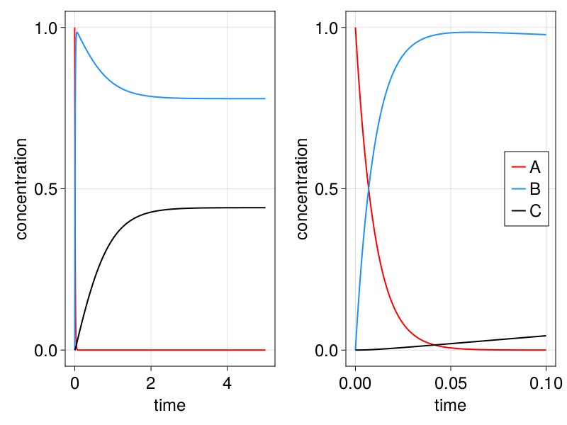
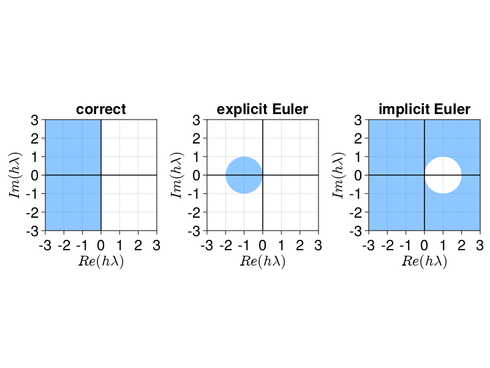
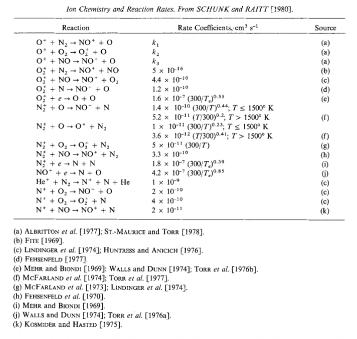
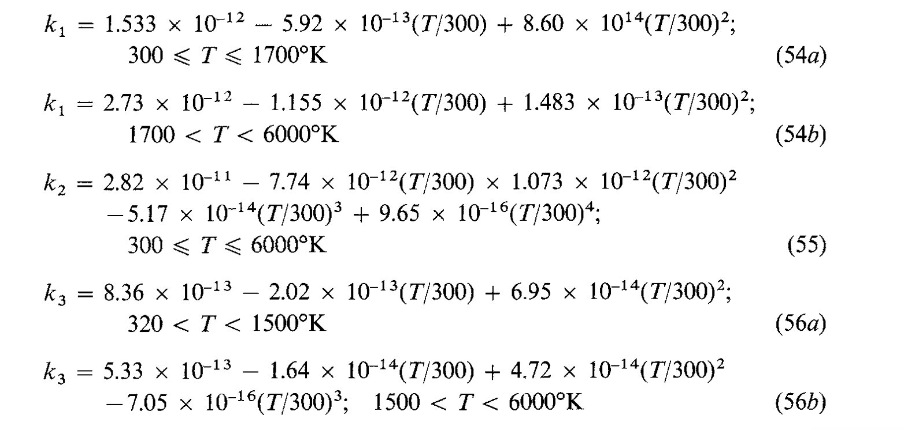

# Modeling chemical reactions
by Flemming Holtorf
## Reactors
The most basic chemical reactor model is a continuously stirred tank reactor (CSTR). Networks of CSTRs can be used to approximate any other reactor (within reason) arbitrarily well. In combination with their simplicity, they lay the foundation for the computational treatment of more complicated settings where chemical reactions play an important role, for example reactive fluids.

The key assumption behind the CSTR model is that the fluid is *well-mixed*, i.e., there are *no* spatial gradients in composition, temperature or pressure. 
Further assuming that pressure and temperature are externally imposed, then the reactor is thermodynamically fully characterized in terms of mole balances for all chemical species/constituents:

$$
\frac{dn_i}{dt} = \dot{n}_{i,in} - \dot{n}_{i,out} + V \sum_{k = 1}^{N_R} \hat{r}_{i,k}(\mathbf{c},p,T)
$$

where 
* $n_i$ refers to the number of moles of species/constituent $i$ 
* $\dot{n}_{i,in}$ ($\dot{n}_{i,out}$) refers to the mole flow rate into (out of) the reactor
* $V$ refers to the volume of the *fluid* in the reactor
* $\hat{r}_{i,k}$ refers to the rate of formation/consumption of species $i$ due to reaction $k$
* $\mathbf{c} = [c_1, \dots, c_N]$ refers to the composition of the fluid (usually in molar concentration of all the constituents but sometimes different abstractions (mole fractions, mass fractions, chemical potential, $\dots$) are more appropriate.)
* $T$ refers to the temperature in the fluid
* $p$ refers to the pressure in the fluid.

In practice, often further simplifications apply. For example, in many situations it is warranted to assume that the fluid volume is constant and independent of composition. Under this assumption, the model reduces to the commonly used form

$$
\frac{dc_i}{dt} = D(c_{i,in} - c_{i}) + \sum_{k = 1}^{N_R} \hat{r}_{i,k}(\mathbf{c},p,T)
$$

where
* $c_i = \frac{n_i}{V}$ refers to the molar concentration of species/constitutent $i$
* $D= \frac{\dot{V}}{V}$ refers to the throughput rate (note that $\dot{V}=\dot{V}_{in} = \dot{V}_{out}$ by assumption)
* $\mathbf{c} = [c_1, \dots, c_N]$ refers to the composition of the fluid (usually in molar concentration of all the constituents but sometimes different abstractions (mole fractions, mass fractions, chemical potential, $\dots$) are more appropriate.)
* $T$ refers to the temperature in the fluid
* $p$ refers to the pressure in the fluid

In the following sections, we discuss how the reaction terms $\hat{r}_{i,k}$ are treated computationally, introduce simple models and discuss stiffness.

## Chemical Reactions
On a fundamental level, chemical reactions are described as discrete transitions of the form

$$
    \nu^{-}_{1} A_1 + \nu^{-}_{2} A_2 + \cdots + \nu_{n}^{-} A_N \to \nu_{1}^{+} A_1 + \nu_{2}^+ A_2 + \cdots + \nu_{n}^{+} A_N 
$$

which is to be parsed as: $\nu^{-}_{1}$ molecules of species $A_1$, $\nu^{-}_{2}$ molecules of species $A_2$, $\dots$, and $\nu_{n}^{-}$ molecules of species $A_N$ react to form $\nu^{+}_i$ molecules of species $A_i$. 

This microscopic model translates 1-1 into the macroscopic description where the formation/consumption rate of species $A_i$ due to reaction $k$ is given by 

$$
\hat{r}_{i,k}(\mathbf{c},T,p) = (\nu^+_{i,k} - \nu^-_{i,k})\hat{r}_k(\mathbf{c},T,p)
$$

where $r_k$ is the rate of reaction $k$.

This leads to a rather dense and convenient description of CSTR models

$$
\frac{d\mathbf{n}}{dt} = \dot{\mathbf{n}}_{in} - \dot{\mathbf{n}}_{out} + V\mathbf{S} \mathbf{r}(\mathbf{c},T,p)
$$

where 
* $\mathbf{n} = [n_1,\dots,n_N]$ refers to the mole counts of the chemical species
* $\dot{\mathbf{n}}_{in} = [\dot{n}_{1,in},\dots,\dot{n}_{N,in}]$ ($\dot{\mathbf{n}}_{out}$) refers to the molar inlet (outlet) flowrate of the chemical species
* $V$ refers to the fluid volume
* $\mathbf{S}$ refers to the *stoichiometry matrix* with $\mathbf{S}_{i,k} = \nu_{i,k}^+ - \nu_{i,k}^{-}$
* $\mathbf{r}(\mathbf{c},T,p) = [r_1(\mathbf{c},T,p), \dots, r_{N_R}(\mathbf{c},T,p)]$ refers to the reaction rates
* T refers to the temperature in the fluid
* p refers to the pressure in the fluid.

The last puzzle piece required to complete the reactor model is a consitutive relation that maps the composition, temperature and pressure to the reaction rates $r_k$. For such models, one can draw from the rich and deep theory of chemical kinetics an overview of which is beyond the scope of this introduction. Due to their practical relevance we will restrict our review here to mass-action based kinetics:

$$
r_k(\mathbb{c},T,p) = k(T) \prod_{i=1}^N c_i^{|\nu_{i,k}^{-}|}. 
$$

This relation structure can be justified by statistical mechanics considerations which give further insights with regard to the validity of this model. The temperature-dependence of the reaction rate "constant" $k(T)$ itself can be modeled in various ways. A very popular functional form that is found to be phenomenologically correct in many settings and can be justified via transition state theory is the modified Arrhenius equation:

$$
    k(T) = AT^{n} e^{-\frac{E_a}{k_B T}} 
$$

where
* $A$ is an *actual* constant
* $E_a$ the activation energy barrier
* $k_B$ the Boltzmann constant
* $T$ temperature.

The parameters of this relation are the constant $A$, exponent $n$, and activiation energy $E_a$. These can be found in the literature for a wide range of reactions, or alternatively be computed ab initio with quantum chemical models. 

## Chemical reactions and stiffness
The computational study of chemical reactions highlights a fundamental challenge for the numerical solution of ODEs: stiffness. In the context of dynamical systems, stiffness refers losely speaking to the separation of time scales into *fast* and *slow* components. This causes problems for numerical integration as one is required to resolve the fast dynamics, which intuitively speaking means one is restricted to small time steps, while also requiring long simulation horizons to observe the slow dynamics take effect; overall, a large number of time steps is needed for an accurate solution, rendering the simulation expensive.

Chemical reactions are notorious for giving rise to stiff dynamical systems (the time scales at which the reactions in a single reactor take place can vary across many orders of magnitude). A simple example for that is given by the generic reaction network

$$
    A \xrightarrow{k_1} B \xrightleftharpoons[k_3]{k_2} 2C
$$

Assuming isochoric and isothermal operation, a CSTR (without in and outlet streams) can be modeled as

$$
    \frac{d}{dt}\begin{bmatrix}
    c_A\\
    c_B\\
    c_C
    \end{bmatrix} = \underbrace{\begin{bmatrix} -1 & 0 & 0\\
    1 & -1 & 1 \\
    0 & 2 & -2 
    \end{bmatrix}}_{=\mathbf{S}} \underbrace{\begin{bmatrix} k_1 c_A \\
    k_2 c_B\\
    k_3 c_C^2 
    \end{bmatrix}}_{= \mathbf{r}(\mathbf{c},T,p)}
$$

with reaction rate constants $k=\left[100 \frac{1}{\text{s}}, 0.25 \frac{1}{\text{s}}, 1 \frac{\text{L}}{\text{mol} \cdot \text{s}}\right]$. 

Solving this ODE system yields concentration profiles as shown below.

The traces show quite clearly that dynamics involving the chemical conversion from A to B occur at much faster time scales than the equilibration between the species B and C. 

## Stability in the presence of stiffness
Major limitations arising from stiffness  
The stability properties of numerical integrators are studied via Dahlquist's test equation:

$$
    \frac{dx}{dt} = \lambda x
$$

Specifically, the region of stabily of a given numerical integrator $\phi$ giving rise to the integration recursion

$$
    x(t+h) = \phi(x(t), y \mapsto \lambda y, h)
$$

is the set $\lbrace \lambda h \in  \mathbb{C} : \lim_{k \to \infty} |x(t+k h)| = 0 \rbrace$, i.e., the region where the recursion is asymptotically stable.

The region of stability of the analytical integrator is of course the left half-plane, i.e., $\lbrace \lambda h \in \mathbb{C} : Re(\lambda h) < 0 \rbrace$. However, the region of stability for the explicit Euler method is only 
$\lbrace \lambda h \in \mathbb{C} : |\lambda h + 1 | \leq 1   \rbrace$, i.e., it is merely the unit disk in the imaginary plane centered at (-1,0). *(Excercise: verify this yourself)* Put differently, the explicit Euler method may predict instable trajectories when the true solution is stable - clearly undesirable. 

In contrast, the region of stability for the implicit Euler method is $\lbrace \lambda h \in \mathbb{C}: |1-\lambda h| \geq 1 \rbrace$, i.e., the complement of the unit disk in the imaginary plane centered at (1,0). *(Excercise: verify this yourself)* Or put differently, the implicit Euler method may predict stable trajectories when the true solution does not - also clearly undesirable.

## Implicit time-stepping

## Runge-Kutta Methods

## Excercise I: Various time-stepping methods
In this excercise we wish to compare to the stability and performance performance properties of different integration schemes. To that end, complete the code template that implements the following four integration routines
* Explicit Euler
* Implicit Euler
* Crank-Nicolson's method 
* Heun's method
  
and apply it to the simulation of an isothermal, isochoric CSTR without inlet and outlet streams. The underlying reaction network is given by

$$
    A \xrightarrow{k_1} B \xrightleftharpoons[k_3]{k_2} 2C
$$

with reaction rate constants $k=\left[100 \frac{1}{\text{s}}, 0.25 \frac{1}{\text{s}}, 1 \frac{\text{L}}{\text{mol} \cdot \text{s}}\right]$ and initial concentration $\mathbf{c}_0 = [1,0,0]$ over a horizon of $t\in [0,10.0]$. The kinetics follow mass action kinetics.  

Specifically, simulate this system with all different methods for the step sizes $h \in \lbrace 10^{-4}, 10^{-3}, 10^{-2}, 10^{-1}, 1, 10 \rbrace$ and compare 
* the trajectories of the concentrations $c_A(t), c_B(t), c_C(t)$ predicted by each method by plotting the traces for each step size $h$. 
* the computational efficiency of each method by plotting the time required for integration as a function of the step size $h$
* the accuracy of each method by comparing the computed result $c_A(0.01)$ to the analytical solution $c_{A,\text{exact}}(0.01) = c_{A,0}/e$ for each step size $h$.  

### Explicit Euler:
The explicit Euler method applies the following explicit scheme

$$
    x_{k+1} = x_k + h f(x_{k}, t_k)
$$

### Implicit Euler:
The implicit Euler method applies the following implicit scheme

$$
    x_{k+1} = x_k + h f(x_{k+1}, t_k + h)
$$

### Crank-Nicolson method:
The Crank-Nicolson method applies the following implicit scheme

$$
    x_{k+1} = x_k + \frac{h}{2} \left( f(x_k, t_k) + f(x_{k+1}, t_k + h) \right)
$$

### Heun's method
Heun's method applies the following explicit scheme
$$  
    y = x_k + h f(x_k, t_k)  \\

    x_{k+1} = x_k + \frac{h}{2} \left( f(x_k, t_k) + f(y, t_k + h) \right)
$$

## Excercise II: Ionospheric chemistry model

Schunk 1988 proposes the following reaction network to capture the dominant chemical phenomena in the ionosphere. 

Would you assume the associated reaction system is stiff? Why or why not?

Complete the template Ionosphere chemistry model and set up a simulation that determines the the decay rate when the reactor is fed at constant inflow rate with the following composition:

## Excercise III: Reaction-Diffusion-Advection Equation

## References
Schunk, R. W. "A mathematical model of the middle and high latitude ionosphere." Pure and applied geophysics 127.2 (1988): 255-303.

